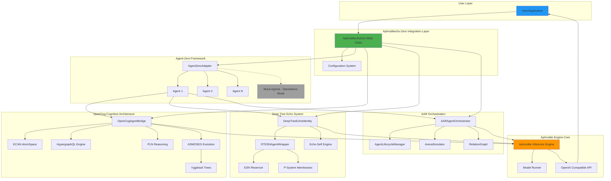
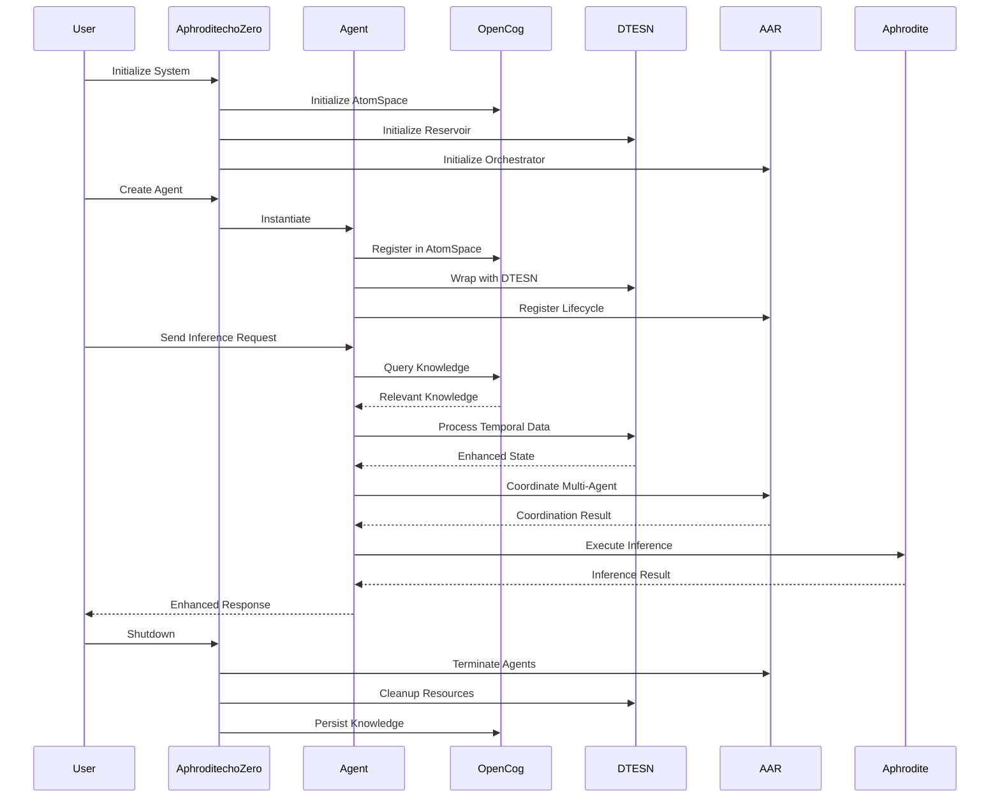
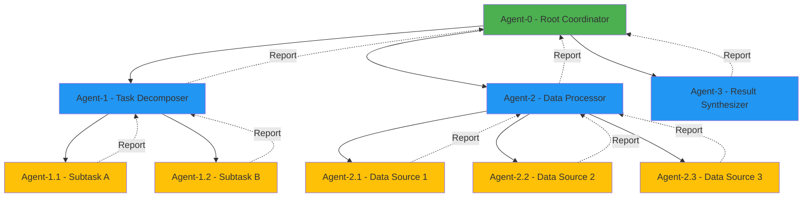
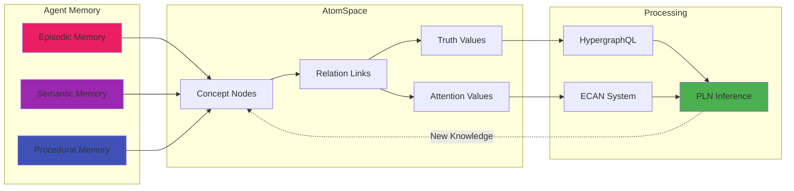
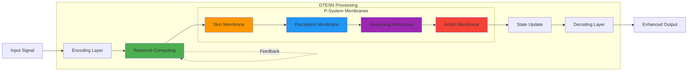
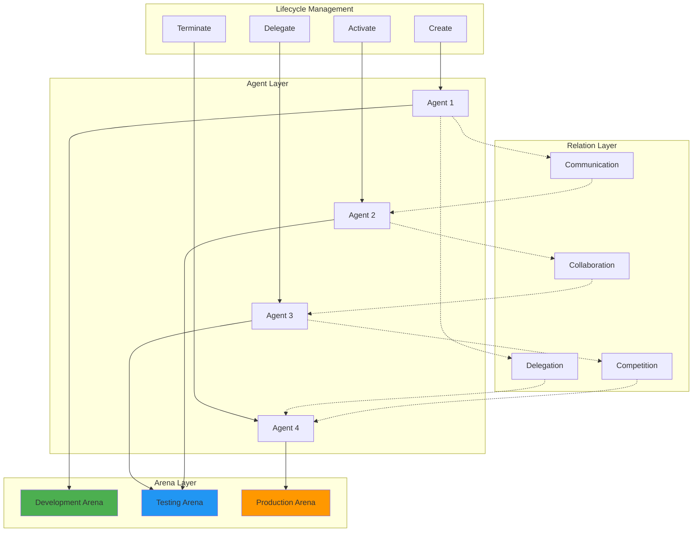
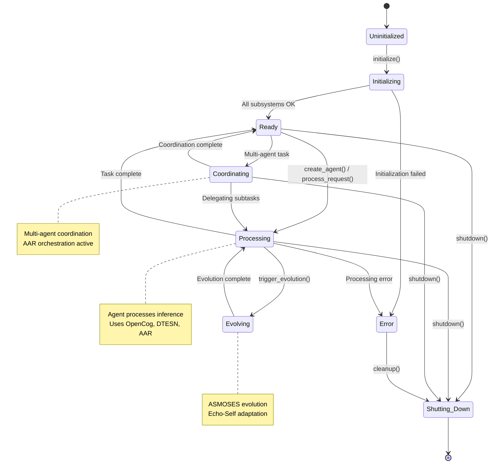
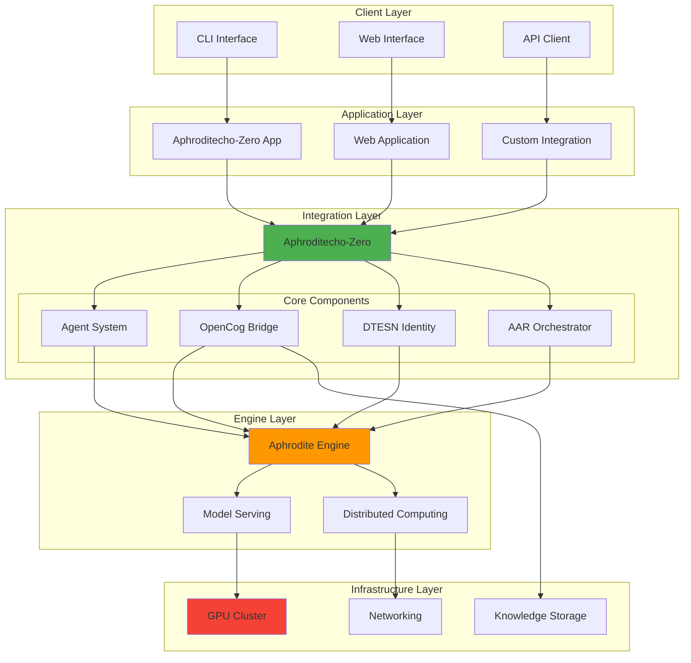

# Aphroditecho-Zero System Architecture

## Complete System Architecture Diagram

## Data Flow Architecture

## Component Integration Matrix

| Component | Agent-Zero | OpenCog | DTESN | AAR | Aphrodite |
|-----------|-----------|---------|-------|-----|-----------|
| **Agent-Zero** | ● | → | → | → | → |
| **OpenCog** | ← | ● | - | - | → |
| **DTESN** | ← | - | ● | - | → |
| **AAR** | ← | - | - | ● | → |
| **Aphrodite** | ← | ← | ← | ← | ● |

Legend:
- ● = Core functionality
- → = Provides data/services to
- ← = Receives data/services from
- \- = No direct integration

## Hierarchical Agent Structure

## Knowledge Flow in OpenCog Integration

## DTESN Processing Pipeline

## AAR Orchestration Model

## System States and Transitions

## Deployment Architecture

---

This comprehensive architecture documentation shows how all components of Aphroditecho-Zero integrate to create a powerful hybrid cognitive system combining agent-zero's multi-agent orchestration, OpenCog's cognitive architecture, Deep Tree Echo's membrane computing, and Aphrodite Engine's high-performance inference capabilities.
