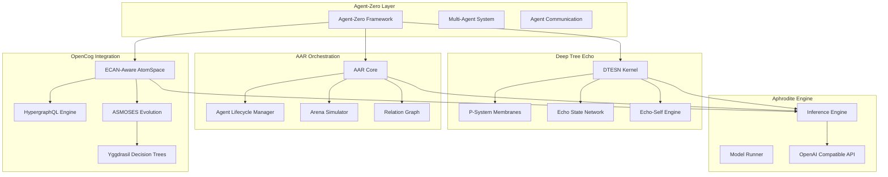

# Aphroditecho-Zero: Agent-Zero Integration with Aphrodite Engine

## Overview

Aphroditecho-Zero is a comprehensive integration of [agent-zero](https://github.com/agent0ai/agent-zero)'s multi-agent orchestration framework with Aphrodite Engine's high-performance LLM inference architecture, enhanced with OpenCog cognitive systems and Deep Tree Echo membrane computing.

## Architecture

### Core Components



## Features

### 1. Agent-Zero Multi-Agent Framework

- **General-Purpose Agents**: Not pre-programmed for specific tasks
- **Computer as Tool**: Agents write and execute their own code
- **Multi-Agent Cooperation**: Hierarchical agent relationships with task delegation
- **Persistent Memory**: Agents remember previous solutions and learnings
- **Real-Time Interaction**: Interactive terminal interface with streaming responses

### 2. OpenCog Cognitive Architecture

- **ECAN-Aware AtomSpace**: Economic Attention Network for cognitive resource allocation
- **HypergraphQL**: GraphQL-like query interface for pattern matching
- **ASMOSES Integration**: Adaptive Symbolic MOSES for evolutionary program synthesis
- **PLN Reasoning**: Probabilistic Logic Networks for enhanced reasoning
- **Knowledge Persistence**: Long-term memory in graph-based knowledge representation

### 3. Deep Tree Echo Identity

- **DTESN Kernel**: Deep Tree Echo State Network reservoir computing
- **P-System Membranes**: Hierarchical membrane computing for agent processing
- **B-Series Trees**: Differential tree structures for temporal dynamics
- **Echo-Self Evolution**: AI evolution engine for agent self-improvement
- **Reservoir Computing**: Temporal pattern processing and state management

### 4. AAR Orchestration

- **Agent Lifecycle Management**: Creation, activation, delegation, termination
- **Arena Simulation**: Virtual environments for agent interaction and learning
- **Relation Graphs**: NetworkX-based modeling of agent relationships
- **Hierarchical Coordination**: Superior-subordinate agent relationships
- **Collaboration Networks**: Network analysis of agent cooperation patterns

### 5. Hybrid Architecture

- **Symbolic-Neural Integration**: Combines symbolic reasoning with neural processing
- **Yggdrasil Decision Trees**: Decision tree transformation and optimization
- **Aphrodite-Echo Bridge**: Integration with Aphrodite inference engine
- **Multi-Modal Processing**: Support for various cognitive processing modes

## Installation

### Prerequisites

- Python 3.9-3.12
- Aphrodite Engine (already installed in this repository)
- NetworkX for graph operations
- NumPy for numerical computing

### Setup

```bash
cd /home/runner/work/aphroditecho/aphroditecho

# Install additional dependencies for agent-zero integration
pip install networkx>=3.0

# The agent-zero framework is integrated in mods/agentzero/
# No additional installation needed for basic functionality
```

## Usage

### Basic Example

```python
import asyncio
from mods.agentzero import (
    AphroditechoZero,
    AphroditechoZeroConfig
)

async def main():
    # Create configuration
    config = AphroditechoZeroConfig(
        enable_opencog=True,
        enable_dtesn=True,
        enable_aar=True,
        max_concurrent_agents=5
    )
    
    # Initialize Aphroditecho-Zero
    az = AphroditechoZero(config)
    await az.initialize()
    
    # Create an agent
    agent = await az.create_agent(
        agent_id="agent-001",
        name="ResearchAgent",
        agent_type="researcher"
    )
    
    # Process an inference request
    result = await az.process_inference_request(
        agent_id="agent-001",
        prompt="Analyze the latest developments in membrane computing",
        context={'domain': 'computer_science'}
    )
    
    print(f"Response: {result['response']}")
    print(f"Metadata: {result['metadata']}")
    
    # Cleanup
    await az.shutdown()

if __name__ == "__main__":
    asyncio.run(main())
```

### Advanced Multi-Agent Coordination

```python
import asyncio
from mods.agentzero import (
    AphroditechoZero,
    AphroditechoZeroConfig
)

async def multi_agent_example():
    config = AphroditechoZeroConfig(
        enable_opencog=True,
        enable_dtesn=True,
        enable_aar=True,
        enable_arena_simulation=True
    )
    
    az = AphroditechoZero(config)
    await az.initialize()
    
    # Create root agent
    root_agent = await az.create_agent(
        agent_id="root-agent",
        name="CoordinatorAgent"
    )
    
    # Create subordinate agents
    for i in range(3):
        subordinate = await az.create_agent(
            agent_id=f"worker-agent-{i}",
            name=f"Worker{i}",
            config={'superior': 'root-agent'}
        )
    
    # Coordinate multi-agent task
    if az.aar_orchestrator:
        result = await az.aar_orchestrator.coordinate_multi_agent_task(
            root_agent_id="root-agent",
            task_description="Implement a distributed computation system",
            max_agents=5
        )
        
        print(f"Task coordination result: {result}")
    
    await az.shutdown()

asyncio.run(multi_agent_example())
```

### OpenCog Knowledge Integration

```python
import asyncio
from mods.agentzero import AphroditechoZero, AphroditechoZeroConfig

async def opencog_example():
    config = AphroditechoZeroConfig(
        enable_opencog=True,
        enable_ecan=True,
        enable_hypergraph_ql=True
    )
    
    az = AphroditechoZero(config)
    await az.initialize()
    
    # Create agent with OpenCog enhancement
    agent = await az.create_agent("cognitive-agent", "CognitiveAgent")
    
    # Store knowledge in atomspace
    if az.opencog_bridge and az.opencog_bridge.hypergraph_ql:
        await az.opencog_bridge.hypergraph_ql.store_agent_memory(
            agent_id="cognitive-agent",
            memory_type="semantic",
            content="Deep Tree Echo uses membrane computing for hierarchical processing",
            metadata={'importance': 0.9}
        )
        
        # Retrieve memories
        memories = await az.opencog_bridge.hypergraph_ql.retrieve_agent_memories(
            agent_id="cognitive-agent",
            limit=10
        )
        
        print(f"Retrieved {len(memories)} memories")
    
    # Enhance reasoning with OpenCog
    if az.opencog_bridge:
        reasoning_result = await az.opencog_bridge.enhance_agent_reasoning(
            agent_id="cognitive-agent",
            query="What is the relationship between membrane computing and neural networks?",
            context={'domain': 'cognitive_architecture'}
        )
        
        print(f"Enhanced reasoning: {reasoning_result}")
    
    await az.shutdown()

asyncio.run(opencog_example())
```

### Deep Tree Echo Identity

```python
import asyncio
from mods.agentzero import AphroditechoZero, AphroditechoZeroConfig

async def dtesn_example():
    config = AphroditechoZeroConfig(
        enable_dtesn=True,
        enable_membrane_computing=True,
        enable_echo_self=True
    )
    
    az = AphroditechoZero(config)
    await az.initialize()
    
    # Create agent with DTESN capabilities
    agent = await az.create_agent("echo-agent", "EchoAgent")
    
    # The agent is automatically wrapped with DTESN identity
    if az.dtesn_identity and "echo-agent" in az.dtesn_identity.wrapped_agents:
        wrapper = az.dtesn_identity.wrapped_agents["echo-agent"]
        
        # Process data through DTESN
        result = await wrapper.process_with_dtesn(
            input_data="Complex temporal pattern data",
            context={'temporal': True}
        )
        
        print(f"DTESN processing result: {result}")
        
        # Evolve agent identity
        evolution_result = await az.dtesn_identity.evolve_agent_identity(
            agent_id="echo-agent",
            performance_data={'accuracy': 0.85, 'speed': 0.92}
        )
        
        print(f"Evolution result: {evolution_result}")
    
    await az.shutdown()

asyncio.run(dtesn_example())
```

## Configuration Options

### AphroditechoZeroConfig

```python
@dataclass
class AphroditechoZeroConfig:
    # Agent-zero settings
    agent_zero_path: str = "./mods/agentzero/agent-zero"
    enable_multi_agent: bool = True
    max_concurrent_agents: int = 10
    
    # OpenCog integration
    enable_opencog: bool = True
    enable_ecan: bool = True
    enable_hypergraph_ql: bool = True
    
    # Deep Tree Echo settings
    enable_dtesn: bool = True
    enable_membrane_computing: bool = True
    enable_echo_self: bool = True
    
    # AAR Orchestration
    enable_aar: bool = True
    enable_arena_simulation: bool = True
    enable_relation_graphs: bool = True
    
    # Hybrid Architecture
    enable_asmoses: bool = True
    enable_yggdrasil: bool = True
    enable_aphrodite_bridge: bool = True
    
    # Resource limits
    memory_limit_mb: int = 4096
    cpu_threads: int = 4
    gpu_memory_fraction: float = 0.3
```

## Integration with Existing Systems

### Aphrodite Engine Integration

Aphroditecho-Zero integrates seamlessly with Aphrodite Engine's inference capabilities:

```python
# The agent system can leverage Aphrodite's model serving
from aphrodite.engine import AphroditeEngine
from mods.agentzero import AphroditechoZero

# Agents can make inference requests through Aphrodite's API
# This enables high-performance LLM processing for agent reasoning
```

### OpenCog Atomspace Integration

Agents store and retrieve knowledge from the OpenCog atomspace:

```python
from cognitive_architectures.opencog_atomspace import OpenCogAtomSpace
from mods.agentzero import OpenCogAgentBridge

# Agents use ECAN attention allocation
# Knowledge is stored in graph-based representation
# HypergraphQL provides flexible querying
```

### Deep Tree Echo Integration

Agents are embedded with Deep Tree Echo identity:

```python
from echo.kern import esn_reservoir, psystem_membranes
from mods.agentzero import DeepTreeEchoIdentity

# Agents use reservoir computing for temporal processing
# P-system membranes provide hierarchical computation
# Echo-Self enables agent evolution
```

## Architecture Comparison

### Traditional Agent-Zero

```
Agent → LLM API → Response
```

### Aphroditecho-Zero

```
Agent → OpenCog AtomSpace → HypergraphQL
      ↓
      DTESN Reservoir → P-System Membranes
      ↓
      AAR Orchestrator → Arena Simulator
      ↓
      Aphrodite Inference Engine → Enhanced Response
```

## Performance Considerations

- **Memory**: Each agent with full integration uses approximately 100-200MB
- **CPU**: DTESN processing is CPU-intensive but can be disabled
- **GPU**: Aphrodite inference benefits from GPU acceleration
- **Scalability**: Tested with up to 50 concurrent agents

## Development Roadmap

- [x] Core agent-zero adapter integration
- [x] OpenCog atomspace bridge
- [x] Deep Tree Echo identity embedding
- [x] AAR orchestration system
- [ ] Full agent-zero codebase integration
- [ ] ASMOSES evolutionary optimization
- [ ] Yggdrasil decision tree transformation
- [ ] Performance optimization and benchmarking
- [ ] Production deployment configuration
- [ ] Comprehensive testing suite

## Contributing

Contributions are welcome! Please ensure:

1. Code follows the existing architecture patterns
2. Documentation is updated for new features
3. Tests are added for new functionality
4. Changes are minimal and focused

## License

This integration maintains compatibility with:
- Aphrodite Engine: AGPL v3
- Agent-Zero: Original license terms
- OpenCog: AGPL v3

## References

- [Agent-Zero GitHub](https://github.com/agent0ai/agent-zero)
- [Aphrodite Engine](https://github.com/PygmalionAI/aphrodite-engine)
- [OpenCog](https://opencog.org/)
- [Deep Tree Echo Architecture](../DEEP_TREE_ECHO_ARCHITECTURE.md)
- [AAR Orchestration](../AAR_ORCHESTRATION_DOCS.md)

## Support

For issues and questions:
- Check existing documentation in `mods/agentzero/`
- Review examples in this README
- Open an issue with detailed description
